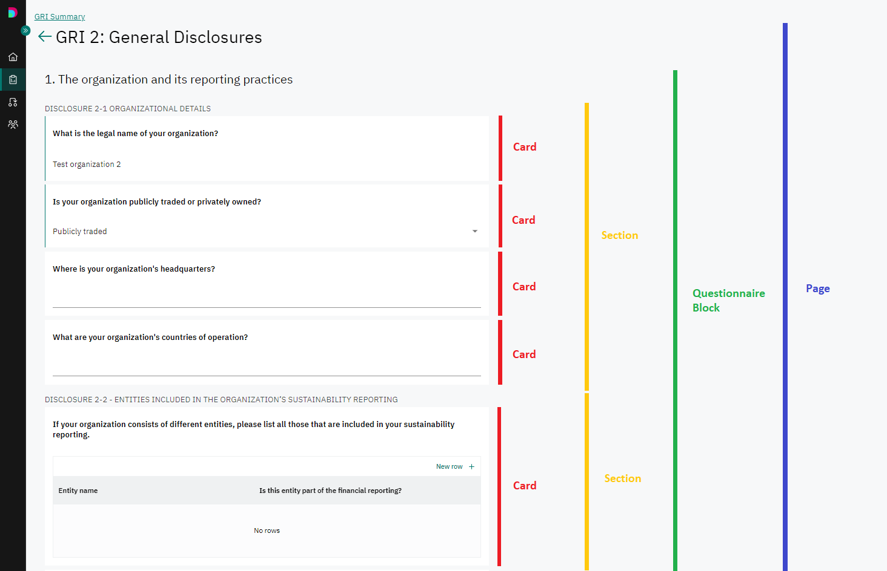
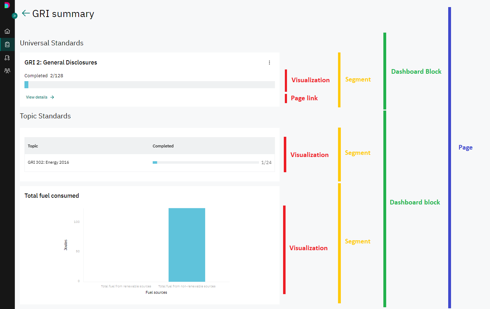

Hi,

Thanks for your interest in the position of Working Student / Intern in Daato.
In order to assess your relevant skills we would like you to perform a task similar to those you will be responsible for when working with us. 

Please read all the instructions very carefully and send back your assessment via email by EOD on 09.10.2022. Good luck!

# Context
Daato is a reporting system helping enterprises measure their ESG (environmental, social, governance) impacts.

Each report we provide is based on a configuration. Configuration is a javascript object used to instantiate a report:
```javascript
const config = {
    // content of the config
};

const report = new Report(config);
```
You can find the detailed schema of the config object in the [schema/config.ts](schema/config.ts) file in this repository. Please read through it before and use as reference during solving the task. 

Below you can find some additional explanation that might be useful to understand the schema.

## Config object
Config object contains:
* a list of data points
* a list of pages
* main page - string containing the id of the page that will be shown when the report is opened
## Data points
Data points are "buckets" used to store the information required for the report. 

They can be of different types. 

Each type has its own `valueOptions` which define details of how the data should be gathered and formatted (e.g. unit for numerical values).
## Pages
Pages define how the report is structured and displayed within the tool.

Each page is build of blocks. 

Blocks come in two types: `"questionnaire"` and `"dashboard"`.

Block of type `"questionnaire"` is used to gather information from the user.
* it contains `sections` - these are used to divide questionnaires into smaller parts and separate related data when needed
    * each `section` contains `cards` - these are used to group and display inputs for individual data points
    * sometimes a card might be shown or not based on the information provided to some data points - this is decided with card's `showCondition` function (see [Functions](#functions) below)



Block of type `"dashboard"` is used to visualize data gathered with the questionnaires and navigate between the pages.
* it contains `segments` - these are boxes representing different data
    * each `segment` contains `visualizations` which are specific charts of different types
        * each visualization type has its own visualizationOptions defining details of how it should be displayed
        * each visualization has `aggregationFunction` which provides a value to be displayed calculated based on the information stored in data points (see [Functions](#functions) below)
    * `segment` can contain `pageLink` that redirects user to another `page` defined in the config (by referencing its ID)


## Functions
There are two types of functions defined in the config:
* `aggregationFunction` - used to provide data for charts in visualizations
* `showCondition` - used to define if a card in a questionnaire should be shown or not

Each function defined in the config has access to `this` object containing `dataPoints`. 

`dataPoints` is an array of data points for which a value has already been provided. E.g.:
```javascript
// this.dataPoints 
[
    {
        id: "textDataPoint",
        value: ["some text"]
    },
    {
        id: "tableDataPoint",
        value: [
            {
                textColumn: "row 1 text",
                multipleSelectColumn: ["choice1", "choice3"]
            },
            {
                textColumn: "row 2 text",
                multipleSelectColumn: ["choice2"]
            },
        ]
    }
]
```
Please note that only data points for which values have already been provided are present in the array. If data point is empty, it is not included here.

`value` of the data point is always an array, even if the data point can store just one value.

Also, please note that `this.dataPoints` doesn't store data points' definitions (like `type` or `valueOptions`). It is generated on runtime and is not the same as `dataPoints` array in the config object!

# Task
You are tasked with building a simple config for a report on company's energy consumption.

It should contain:
* a main page with a dashboard containing:
    * a segment visualizing progress in filling in Company Profile and leading to the page with Company Profile questionnaire
    * a segment visualizing total energy consumption across years 2019-2021 and leading to a page with Energy Consumption questionnaire
* a Company Profile questionnaire page containing:
    * a question about company name
    * a question about company's HQ address
    * a question about company's ownership with options "Privately held" or "Public"
    * a question about company's yearly turnover in the past year
* an Energy Consumption questionnaire page containing:
    * a question about company's energy consumption in kWh per year for years 2019-2021, divided by renewable and non-renewable sources,
    * a question about company's strategy to lower its energy consumption (it can be explained in multiple paragraphs), displayed only if consumption in the last reported year exceeded 1 million kwH

The choice of visualization types, header names etc. belongs to you.

You can write the whole config in one file or split it into multiple and use ES modules syntax to link them together.

Once you are done, please send the result (single file or a zip with the project) via email.

